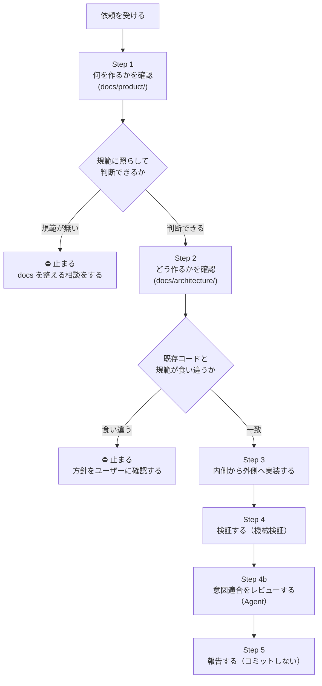

# api-server バックエンド実装ハーネス

## このスキルの目的

**「設計ドキュメントを読まずに実装を始めてしまう」ことを防ぐ。**

このリポジトリでは設計規範が `docs/` に集約されていて、そこを読めば判断できるようになっている。
にもかかわらず実装から入ると、規範に反した構造を作り込んでから気づくことになる。
バックエンドは**内側（ドメイン）から外側（route）へ依存が流れる**設計なので、内側の判断を間違えると
外側まで作り直しになり、手戻りが大きい。

このスキルは、その事故を**手順の形で防ぐ**。

| このスキルがやること                                    | やらないこと                           |
| ------------------------------------------------------- | -------------------------------------- |
| どの順で作業するかを決める                              | 設計規範そのものを定める               |
| 各段階で「どの docs を開くか」を指す                    | docs の内容をここに書き写す            |
| 止まってユーザーに確認すべき地点を明示する              | 規範の無い判断を勝手に決める           |
| docs に書けない運用知（ツール都合・ハマりどころ）を持つ | コードから読めることを重複して説明する |

> **このファイルは規範ではない。** 規範は `docs/` にある。ここに規範を書き写すと二重管理になり、必ず片方が腐る。

## 使うタイミング

`apps/api-server` に**新しい集約・usecase・エンドポイント・DB スキーマ変更**を入れるとき。
既存 usecase の軽微な条件変更だけなら、Step 2 以降だけでよい。

## 入出力契約

### 入力（これが無いと始められない）

| 入力                       | 必須 | 無い場合                                                                                                                                                    |
| -------------------------- | ---- | ----------------------------------------------------------------------------------------------------------------------------------------------------------- |
| 機能の概要                 | ○    | ユーザーに聞く                                                                                                                                              |
| 扱うリソースと所有関係     | ○    | 誰の何を、誰が読み書きできるかを確定させる                                                                                                                  |
| 保存すべきデータと必須条件 | ○    | 下書き可否（nullable）と公開時の必須条件を分けて確認する                                                                                                    |
| 既存の類似実装             | −    | `apps/api-server/src/domain` 配下を自分で grep。**構造の参考にする。公開面（getter・export・スキーマ・index）は写さず、この PR に呼び手があるものだけ足す** |

### 出力（完了時に必ず返す）

| 出力               | 内容                                                                                               |
| ------------------ | -------------------------------------------------------------------------------------------------- |
| 変更ファイル一覧   | 追加 / 変更 / 削除を区別して                                                                       |
| 適用した規範と根拠 | 「この判断は `docs/…` のこの規範による」の対応                                                     |
| 自分で決めた判断   | **規範に無くて暫定で決めたこと**。先例に倣って決めた箇所も判断として列挙する。レビューの焦点になる |
| 検証結果           | test / tsc / lint の**事実**。落ちたなら出力とともに                                               |
| 未解決の確認事項   | 判断を保留した点                                                                                   |
| コミットの有無     | 原則コミットしない。していないことを明示する                                                       |

### 出力（⛔ で中断したとき）

実装を進めず、次を返して判断を仰ぐ。

- **何と何が食い違ったか**（規範のパス / 既存コードの箇所）
- **選択肢**（規範に合わせる / 規範を変える / 例外にする）とそれぞれの影響範囲
- **推奨**とその理由

## 実装フロー



**⛔ の2箇所で必ず止まる。** 勝手に既存へ合わせない・勝手に決めない（CLAUDE.md）。

---

## Step 1. 何を作るかを確認する

`docs/README.md`（索引）で全体像を掴んでから、`docs/product/` を読む。

| 読む                                         | ここで確定させること                     |
| -------------------------------------------- | ---------------------------------------- |
| `docs/product/design-core.md`                | この機能がプロダクトのどの課題に効くのか |
| `docs/product/profile-information-design.md` | どのデータを保持すべきか・その理由       |

バックエンドでも**先にドメインの語彙を確定させる**。種別・分類をあとから足すとマイグレーションが増える。

> **規範は `docs/product/` と `docs/architecture/` のみ。**
> `docs/plans/`（時限的な計画）と `docs/discussions/`（未合意の検討）は判断の根拠にしない。

**⛔ 止まる条件**: 規範が存在しない設計判断が必要になったとき。
コードに落とす前に、**docs 側を整える方向で相談する**（CLAUDE.md）。

## Step 2. どう作るかを確認する

まず `docs/architecture/server/architecture.md` でレイヤー責務と依存方向を押さえる。
そのうえで、着手する部分の規範だけをその都度開く。

| これから作るもの            | 開く規範                                                                                                    |
| --------------------------- | ----------------------------------------------------------------------------------------------------------- |
| DB スキーマ設計             | `docs/architecture/server/database/design.md`（マスタ参照・DB 由来の表示語彙）                              |
| migration 実行              | `docs/architecture/server/database/migration.md`                                                            |
| 同時更新の扱い              | `docs/architecture/server/database/concurrency.md`                                                          |
| VO / entity / policy        | `docs/architecture/server/architecture.md`                                                                  |
| repository（クエリ設計）    | `.claude/rules/code-review-checklist.md` §1 N+1 / §2 過剰取得 / §3 スコープ条件 / §8 SQL とアプリの責務分離 |
| usecase（トランザクション） | `.claude/rules/code-review-checklist.md` §10 トランザクション境界                                           |
| route（URL・メソッド）      | `docs/architecture/server/api-design-guidelines.md`                                                         |
| errorMap                    | `docs/architecture/server/error-handling/README.md`                                                         |
| 外部クライアントの初期化    | `docs/architecture/server/external-clients.md`                                                              |
| 認証・認可                  | `docs/architecture/authentication.md`                                                                       |
| テストの書き方              | `docs/architecture/testing/strategy.md`                                                                     |

**⛔ 止まる条件**: 既存コードが規範と食い違っているとき。
**設計ドキュメントが規範、既存コードは実装結果**。既存に合わせず、ズレを共有して方針を確認する（CLAUDE.md）。

## Step 3. 内側から外側へ実装する

依存方向に沿って作る。外側から作ると内側の変更で作り直しになる。

```
（主体や対象が 2 つ以上の状態を持つなら）状態ユニオン + 遷移シグネチャを型だけで先に書く
  → DBスキーマ + migration → VO → entity(型) → behaviors → factory
  → policy → repository(interface) → repository(impl)
  → capabilities(権能型) → authorization(経路) → infrastructure/capabilities(組み立て)
  → usecase → route → errorMap → 認証スコープ
```

**状態設計を先に置く理由**: 「無ければ下書き」「無ければ 404」のような主体の状態判定を usecase ごとに書くと、書き方が揺れて漏れる。同じ主体への同じ前提が 2 つ以上の usecase に現れるなら、状態ユニオンと畳み込み関数（`authorization/resolution`）に寄せ、usecase は解決済みの主体を権能で受け取る（`docs/architecture/server/architecture.md`「主体の状態も同じ形で解決する」）。1 つの usecase に閉じる前提は、その usecase の `err` に残す。

各 module を作ったら **同階層に `index.test.ts` を必ず置く**（[[feedback_test_every_module]]）。
型だけの module（entity の型定義・repository interface）は対象外。

各段階で Step 2 の対応表から該当ドキュメントを開く。記憶で書かない。

## Step 4. 検証する

```bash
npm test -- --filter api-server           # 全テスト green
cd apps/api-server && npx tsc --noEmit    # 型（vitest は型を見ないので必須）
cd apps/api-server && npx next lint       # lint（Entity の振る舞いの呼び手は local/entity-behavior-has-caller が見る）
npm run knip                              # 呼び手のない export・ファイル・依存
npm run knip:production                   # テストからしか参照されない export
```

- 新規 module すべてに test があるか。
- 自分が足した `export`・Entity の振る舞い・`*Schema` が knip / lint の出力に**新たに**現れていないか。手動 grep で代替しない（`docs/architecture/server/architecture.md`「呼び手のない公開面は機械的に検出する」）。
- `tsc` の**既存エラー**（無関係なテストモック等）と**自分の変更起因**のエラーを切り分ける（`git status` で diff 範囲を確認）。

### Step 4b. 意図適合をレビューする（機械検証では拾えない）

`tsc` / lint / test は構造適合しか見ない。`.claude/rules/code-review-checklist.md` の🔴項目のうち、
スコープ条件の徹底（§3）・権限/機密情報の露出防止（§4）・トランザクション境界（§10）は、
クエリや権限モデルの意味を理解しないと判定できず、機械検証では検知できない。

**`Agent` を1本立てて diff を敵対的にレビューさせる。** 自分の実装を自分で見ると、意図が見えているぶん盲点が残る。
`code-review-checklist.md` を照らし合わせて実行する。§6-1（呼び手のない公開面）は Step 4 の knip / lint が判定するため、ここでは扱わない。

**次のいずれかに触れた変更では必須**（省略しない）:

- repository / usecase（クエリを書く・呼ぶ層）
- policy / capabilities（権限判定に関わる層）
- route の認証スコープ・errorMap

## Step 5. 報告する

- **コミットはユーザーに明示的に言われるまでしない。**
- 変更ファイル一覧と、**自分で判断した箇所**（規範に無くて暫定で決めたこと）を明示する。
- 検証結果は事実のまま報告する。落ちたテストがあれば出力とともに伝える。

---

## docs に書けない運用知

ツール都合・ライブラリ都合で、設計ドキュメントには載らないもの。

- **worktree で作業するなら `npm install` をその場で実行する。** monorepo の依存は worktree に hoist されないため、忘れると `drizzle-kit: command not found` になる。
- **`npm run db:generate -w database` はオフラインで動くが、`drizzle.config` が `DATABASE_URL` を要求する。** ダミー値を渡せば通る。SQL は手書きしない。
- **vitest は型を見ない。** nullable 化のような型変更の波及は、テストが緑でも壊れている。必ず `tsc` を別途走らせる。
- **公開エンドポイントを足すときは `route.ts` の認証適用範囲を確認する。** `*` に `requireAuthMiddleware` が当たっていると、公開したいルートも弾かれる。auth を保護プレフィックスにスコープ化する。
- **静的ルート（`/me/...`）はパラメータルート（`/:id`）より先に登録する。** 逆だと静的パスがパラメータに食われる。
- **ローカル DB は Supabase のコンテナ（`127.0.0.1:54322`）。** `ECONNREFUSED` はほぼ起動忘れ。`docker ps` で確認する。

## やりがちな失敗

- ドキュメントに書いてある仕様をユーザーに聞く → まず `docs/` を grep。
- 規範を読まずに既存コードを真似する（既存が規範とズレている可能性がある）。
- 先例の集約をフルで写す（getter・export・スキーマ・index を一式並べる）。足すのは、この PR に呼び手があるものだけ。
- 一部 module だけテストを書いて満足する（全 module 必須）。
- 型変更の波及を `tsc` で見ずにテストだけで判断する。
- 言われていないのにコミットする。
