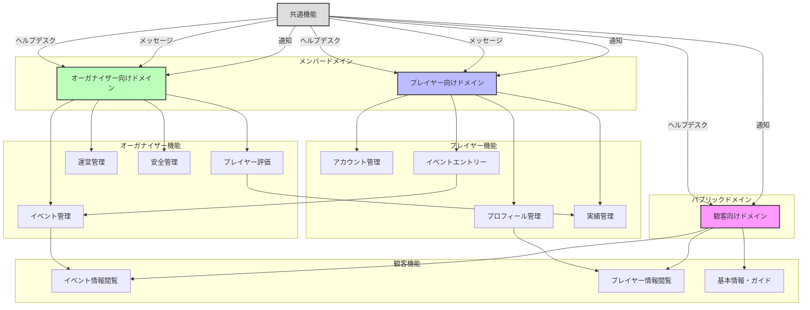
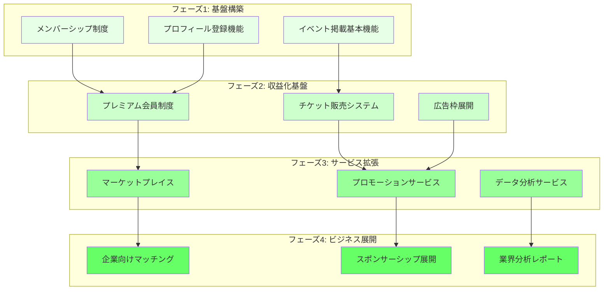
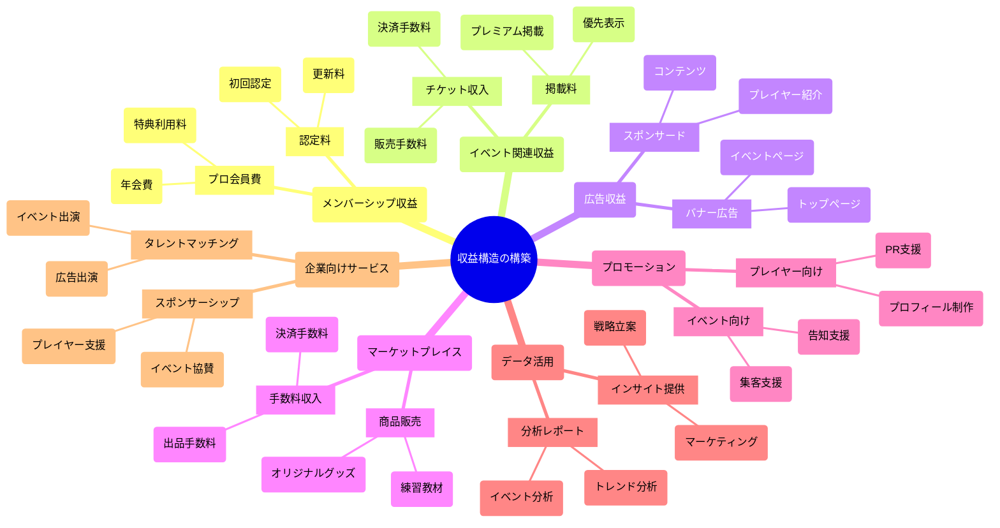

# BeatSinkCentral

日本のビートボックスコミュニティの健全化と持続可能な発展を目指す総合プラットフォーム

  

## 🌟 プロジェクトビジョン

BeatSinkCentralは、日本のビートボックス業界のプロフェッショナル化と持続可能な構造の構築を目指しています。このプラットフォームは、プレイヤー、イベント主催者、観客を繋ぐ中心的なハブとして機能し、コミュニティ内の透明性、安全性、成長を促進します。

## 🚀 MVP - 現在の開発状況

現在、プロジェクトはMVP（Minimum Viable Product）段階で、**プレイヤー紹介機能**の開発に焦点を当てています：

- プレイヤーのプロフィール登録と管理
- スキルや経験の詳細表示
- 活動実績の記録と表示
- 検索・フィルター機能の実装
- レスポンシブなプレイヤー紹介ページ

この基盤を確立した後、イベント管理やコミュニティ機能など、より広範な機能へと拡張していきます。

## 🎯 主な目標

- ビートボックスプレイヤーとコミュニティのための持続可能な収益モデルの創出
- プレイヤーの専門的な基準と認定制度の確立
- イベントの安全性と責任体制の向上
- 才能ある知名度の低いプレイヤーの可視性向上
- イベント運営と参加者管理の効率化
- プレイヤーと潜在的なクライアント/主催者間の信頼関係の構築
- コミュニティの健全な発展と安全な環境の提供

## 🏗️ プラットフォーム構造

プラットフォームは3つの主要ドメインに分かれています：

### 1. パブリックドメイン（一般観客向け）
- イベント情報の閲覧
- プレイヤープロフィールと情報
- ビートボックスガイドと教育コンテンツ

### 2. プレイヤードメイン（メンバー）
- アカウント管理
- イベント登録
- プロフィール管理
- パフォーマンス記録
- スキル認定

### 3. オーガナイザードメイン（メンバー）
- イベント管理
- プレイヤー評価システム
- 運営サポート
- 安全ガイドラインと実施

## 📊 ドメイン構造図

## 🔄 開発フェーズ

### フェーズ1: MVP - プレイヤー紹介
- 基本プロフィール登録
- 公開情報表示
- 活動/パフォーマンス記録
- **現在の開発焦点**

### フェーズ1+: 基本的なエンゲージメント機能
- イベント参加登録
- 活動記録投稿
- プレイヤー間ネットワーキング
- 基本的な予約管理

### フェーズ2: 収益基盤
- チケット販売システム統合
- プレミアムメンバーシッププログラム
- 広告プラットフォーム

### フェーズ3: サービス拡張
- プレイヤー向けマーケットプレイス
- プロモーションサービス
- データ分析サービス

### フェーズ4: ビジネス展開
- 企業クライアントマッチング
- スポンサーシップ機会
- 業界分析レポート

## 📈 フェーズ展開と収益構造

## 💹 収益構造

## 🎮 ユーザー体験

ユーザーは受動的な観客から、サポーター（ファン）へと自然に変化していく状態を目指す体験を提供します：

- **Discover（知る）** → **Understand（活動内容理解する）** → **Support（応援する）**
- プレイヤーとの出会いから、その魅力を理解し、応援者へと自然に導かれる体験
- プレイヤーの個性や表現に出会い、その活動や実績を通じて深く理解し、共感から応援へとつながるフロー

## 📱 UI/UX設計

### プレイヤー一覧ページ
- **受動的ユーザー向け**：
  - プレイヤーのピックアップ表示
  - 新規登録プレイヤー
  - ランダム表示
- **能動的ユーザー向け**：
  - 活動区域検索
  - スタイルのジャンル検索
  - プレイヤー名検索
  - 並び替え機能

### プレイヤー詳細ページ
- **モバイル版**：タブUIによる情報整理
- **デスクトップ版**：一覧表示による効率的な情報閲覧

## 🔍 現在の焦点

現在プロジェクトはフェーズ1にあり、以下の要素を含む堅牢なプレイヤー紹介システムの構築に焦点を当てています：

- 詳細なプレイヤープロフィール
- スキルと経験のドキュメント化
- メディアショーケース
- 検索とフィルター機能
- モバイルとデスクトップに対応したインターフェース

## 💻 技術アーキテクチャ

プラットフォームは以下を活用しています：
- Reactベースのフロントエンドとレスポンシブデザイン
- 動的なプレイヤープロフィールをサポートするデータベース構造
- 異なるユーザーロールを管理する認証と権限システム
- イベント管理システムとの統合機能

## 🔮 将来的な影響

BeatSinkCentralは以下を目指しています：
1. ビートボックスコミュニティの専門的な地位の向上
2. プレイヤーのための持続可能な収入機会の創出
3. イベントとパフォーマンスの業界標準の確立
4. すべてのコミュニティメンバーのための安全な環境の提供
5. ビートボックスアーティストと商業的機会の間のギャップを埋める
