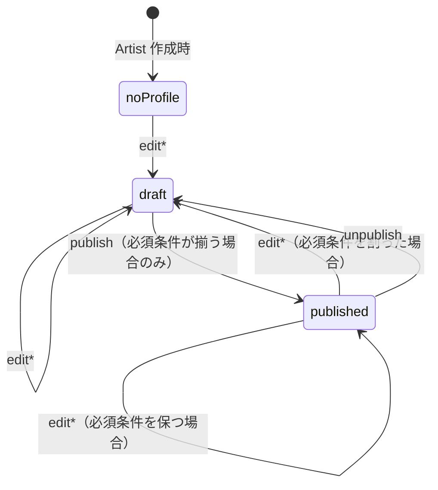
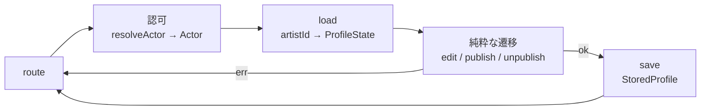

# プロフィールのワークフローを型で先に書く

関数型 DDD（Domain Modeling Made Functional）の手順で、アーティストプロフィールのワークフローを **型だけで** 書き切る。実装はここでは考えない。書き終えた型を今の実装（PR #315 時点）と並べ、余計なもの・足りないものを判定する。

**位置づけ**: この型に沿って実装済み（PR #315）。規範部分は `docs/architecture/server/architecture.md`「状態遷移を持つ集約は状態ごとの型と純粋関数で表す」に昇格した。§4 の「PR #315 時点の実装」は組み直す前の中間形を指す。

---

## 0. 前提（プロダクト規範から引き継ぐもの）

- プロフィールは **保存（下書き）と公開を分ける**。途中保存を許す（`flow-design.md` §4-4）
- 公開の必須条件は 名前・写真・Story の「始まり」の章・ジャンル 1 つ以上・リンク 1 つ以上（`ensurePublishable` が唯一の規範）
- **公開中に必須条件を割る保存をしたら、保存と同時に非公開へ降ろす**（`flow-design.md` §4-4 の唯一の例外）
- 非公開に戻す手段を用意する。降ろした内容は下書きとして残る
- 操作できるのは本人（Actor = User + Artist が揃っている呼び手）だけ

---

## 1. 状態（State）

永続化されている値も含めて、プロフィールが取りうる状態を **排他的な型** で列挙する。boolean で状態を表さない。

```ts
// ---- 中身（状態をまたいで共通の内容）----
type ProfileContent = {
  name: ProfileName | null;
  tagline: Tagline | null;
  imageUrl: ImageUrl | null;
  chapters: readonly StoryChapter[];
  activityInfo: ActivityInfo | null;
  genres: readonly Genre[];
  links: readonly ProfileLink[];
  presentationPattern: PresentationPatternCode | null;
};

// 公開の必須条件が揃っていることを「型で」表した中身。
// Draft から Published へ移るときだけ作られ、直接は組み立てられない（smart constructor）
type PublishableContent = ProfileContent & {
  readonly name: ProfileName; // null でない
  readonly imageUrl: ImageUrl; // null でない
  readonly chapters: readonly [StoryChapter, ...StoryChapter[]]; // "beginning" を含む（構造では表せないため constructor が検証）
  readonly genres: readonly [Genre, ...Genre[]];
  readonly links: readonly [ProfileLink, ...ProfileLink[]];
};

// ---- 状態 ----
type NoProfile = {
  readonly kind: "noProfile";
  readonly artistId: ArtistId;
};

type DraftProfile = {
  readonly kind: "draft";
  readonly id: ProfileId;
  readonly artistId: ArtistId;
  readonly content: ProfileContent;
};

type PublishedProfile = {
  readonly kind: "published";
  readonly id: ProfileId;
  readonly artistId: ArtistId;
  readonly content: PublishableContent; // ← 公開中は必須条件が揃っていることが型で保証される
};

type ProfileState = NoProfile | DraftProfile | PublishedProfile;

// 保存できるのは「存在する」状態だけ
type StoredProfile = DraftProfile | PublishedProfile;
```



**この時点で決まること**

- 「公開中なのに必須項目が欠けている」状態は **型として存在しない**。`enforcePublishInvariant` が保存時に直す必要がなく、`edit` の戻り値型がその事実を持つ
- `published: boolean` は消える。`kind` が状態を表す

---

## 2. 遷移（Workflow）

各遷移を **純粋関数の型** で書く。入力型が「どの状態から呼べるか」、出力型が「どの状態へ移るか」を表す。I/O は含まない。

```ts
// ---- 編集（5 種類。すべて同じ形）----
// どの状態からでも呼べる（無ければ下書きを起こす）。
// 戻り値が Draft | Published なのは「公開中の編集は必須条件を割ると Draft に落ちる」ため。
type EditAttributes = (
  state: ProfileState,
  input: AttributesInput,
) => Result<StoredProfile, AttributesFieldError>;

type WriteStoryChapter = (
  state: ProfileState,
  input: StoryChapterInput,
) => Result<StoredProfile, InvalidStoryChapterFormatError>;

type ReplaceLinks = (
  state: ProfileState,
  input: readonly ProfileLinkInput[],
) => Result<StoredProfile, CreateProfileLinkError>;

type ChoosePresentationPattern = (
  state: ProfileState,
  input: PresentationPatternInput,
) => Result<StoredProfile, InvalidPresentationPatternError>;

type ChangeImage = (
  state: ProfileState,
  input: ImageUrlInput,
) => Result<StoredProfile, InvalidImageUrlFormatError>;

// ---- 公開 / 非公開 ----
// Draft からしか呼べない。NoProfile を渡すことは型で不可能（= 404 はここに現れない）。
type Publish = (
  state: DraftProfile,
) => Result<PublishedProfile, ProfileNotPublishableError>;

// Published からしか呼べない。失敗しない。
type Unpublish = (state: PublishedProfile) => DraftProfile;
```

**編集 5 種の共通形を 1 つにまとめる**なら、内容の書き換えと状態の再判定を分けて書ける。

```ts
// 内容の書き換え（状態に無関心）
type Revise<I, E> = (
  content: ProfileContent,
  input: I,
) => Result<ProfileContent, E>;

// 書き換え後の内容から状態を決め直す（必須条件が揃えば Published を保てる）
type Settle = (before: ProfileState, after: ProfileContent) => StoredProfile;
//   before が Published かつ after が publishable  → Published
//   それ以外                                       → Draft
//   before が NoProfile なら id を新規発番

// 編集ワークフロー = revise してから settle する
type Edit<I, E> = (
  revise: Revise<I, E>,
) => (state: ProfileState, input: I) => Result<StoredProfile, E>;
```

`Settle` が今の `enforcePublishInvariant` の正体で、「保存時に黙って降ろす」ではなく「遷移の戻り値が Draft になる」と読める位置に来る。

---

## 3. I/O（両端）

純粋なワークフローの前後にだけ I/O を置く。

```ts
// 読む: artistId から現在の状態を復元する。無い場合も「状態」として返す（null にしない）
type LoadProfile = (artistId: ArtistId) => Promise<ProfileState>;

// 書く: 存在する状態だけ保存できる
type SaveProfile = (state: StoredProfile) => Promise<StoredProfile>;

// 誰が: 認可層がすでに持っている
type ResolveActor = (subId: string) => Promise<ActorResolution>;
```

usecase はこの 3 つを並べる「サンドイッチ」になる。

```ts
// usecase の形（すべての編集で同じ）
const editAttributes = async (caps, input) => {
  const state   = await caps.artistProfiles.load(caps.actor.artist.getArtistId()); // 読む
  const revised = domain.editAttributes(state, input);                             // 純粋
  if (!revised.ok) return revised;
  const saved   = await caps.artistProfiles.save(revised.value);                   // 書く
  return ok(toView(saved));
};

// 公開
const publishMyProfile = async (caps, input) => {
  const state = await caps.artistProfiles.load(artistId);
  if (state.kind !== "draft") return err(...);   // ← ここだけ判断が要る（§5 の論点）
  const published = domain.publish(state);
  ...
};
```



---

## 4. 今の実装との比較

| 観点                                | 型で書いたもの                                                  | PR #315 時点の実装                                                 | 判定                                                                            |
| ----------------------------------- | --------------------------------------------------------------- | ------------------------------------------------------------------ | ------------------------------------------------------------------------------- |
| 「無い」の表現                      | `NoProfile` が `ProfileState` の一員。`load` の戻り値に含まれる | `ProfileResolution`（`capabilities`）を認可層が畳む                | **余計**。畳み込みはワークフローの入力型が引き受ける。認可層は Actor だけで良い |
| 「無ければ下書き」                  | `Edit` が `ProfileState` を受けるので関数の中で網羅処理         | `toEditableProfile` + 経路 `artistProfileEdit`                     | **余計**。経路 1 本を減らせる                                                   |
| 「無ければ 404」                    | `Publish` が `DraftProfile` しか受けない。渡せない              | `toExistingProfile` + 経路 `artistProfilePublish`                  | **余計**。ただし「Draft でないとき何を返すか」の判断は usecase に残る（§5）     |
| 公開中の不変条件                    | `PublishedProfile.content: PublishableContent`。型で保証        | `published: boolean` + `enforcePublishInvariant`（保存時に降ろす） | **足りない**。今は型で保証されていない                                          |
| 編集で公開が落ちる事実              | `Edit` の戻り値 `Draft \| Published` に現れる                   | 保存時の副作用として隠れている                                     | **足りない**                                                                    |
| Entity の形                         | 状態ごとの record + 純粋関数                                    | クロージャ 1 型 + 振る舞い                                         | **要判断**（§5）                                                                |
| 認可（誰が）                        | `ResolveActor` のみ                                             | `ActorResolution` + 経路                                           | **一致**。そのまま                                                              |
| usecase に Reader を渡さない        | `load` は Reader。usecase が読む                                | Writer だけを渡す                                                  | **方針転換**。読むのは usecase の仕事に戻る。揺れは `Edit` の入力型が防ぐ       |
| NotFound を usecase で作らない lint | `Publish` で Draft 以外を弾くのは usecase                       | `usecase-subject-not-found`                                        | **要判断**。lint の対象を Actor 系に絞るか、外す                                |

まとめると、**PR #315 で足した「解決ユニオン・畳み込み・経路 2 本・中間権能」は、ワークフローの型を先に書いていれば作らなかった部品**である。一方で、型が指す「公開中の不変条件を型で持つ」「編集が公開を落とす事実を戻り値に出す」は、今の実装に無い。

---

## 5. 決めるべき論点

### 論点 1: Entity をクロージャ 1 型から状態ごとの型に分けるか

型で書いた世界では `DraftProfile` と `PublishedProfile` は別の型で、振る舞いは純粋関数。今の repo は「Entity はクロージャで振る舞いを持つ」が規範（`architecture.md`「classを用いないOOP」）。

| 選択                    | 得るもの                                                                              | 失うもの                                                                |
| ----------------------- | ------------------------------------------------------------------------------------- | ----------------------------------------------------------------------- |
| 状態ごとの型 + 純粋関数 | 公開中の不変条件が型で保証される。`enforcePublishInvariant` が消える。`kind` の網羅性 | クロージャ Entity の規範との不整合。他集約（User / Artist）との形の違い |
| クロージャ 1 型のまま   | 既存規範と一致。変更が小さい                                                          | 不変条件は実行時保証のまま。`published: boolean` が残る                 |

**推奨**: プロフィールだけ状態ごとの型に分ける。理由は、状態を持つ集約はプロフィールだけで、他集約は状態遷移を持たないため規範を二分しても混乱が小さい。`architecture.md` に「状態遷移を持つ集約は状態ごとの型 + 純粋関数、持たない集約はクロージャ Entity」と 1 行足す。

### 論点 2: `Publish` に Draft 以外が来たときの扱い

型は `Publish: DraftProfile → ...` だが、HTTP から来る要求は `load` の結果が何であれ届く。`NoProfile` なら 404、`Published` なら「すでに公開中」を ok で返すか 409 か。**この判断は usecase に残る**（ワークフローの外側の話で、型では消せない）。

**推奨**: `NoProfile → ArtistProfileNotFoundError`、`Published → ok（冪等）`。`publishMyProfile` の中で `switch (state.kind)` を書く。usecase に `kind` の分岐が 1 つ残るが、これは「どの遷移を呼ぶか」の選択であって「主体の有無の判定」ではない。

### 論点 3: `usecase-subject-not-found` lint をどうするか

論点 2 の推奨を採ると `publishMyProfile` が NotFound を作る。lint は Actor 系（`userNotFound` / `artistNotFound`）に絞るか、外す。

**推奨**: Actor 系に絞る。Actor は認可層が解決する規範が明確で、usecase が作ってはいけない。プロフィールは `load` が状態を返し usecase が遷移を選ぶので、NotFound の生成が usecase に来るのは正しい。

### 論点 4: `Settle` を関数として独立させるか、各 `edit` に埋めるか

**推奨**: 独立させる。「公開中の編集は必須条件を割ると Draft に落ちる」は 5 つの編集で共通の規則で、1 箇所に置くべき。今の `enforcePublishInvariant` をそのまま `settle` に改名して戻り値を `StoredProfile` にすれば良い。

---

## 6. この型に合わせて実装を直すときの手順（実装はまだしない）

1. `domain/artistProfiles` に `ProfileState`（3 状態）と `PublishableContent` の smart constructor を置く
2. 純粋関数 `editAttributes / writeStoryChapter / replaceLinks / choosePresentationPattern / changeImage / publish / unpublish / settle` を置く
3. `IArtistProfileReader.load: artistId → ProfileState`（null を返さない）、`IArtistProfileWriter.save: StoredProfile → StoredProfile`
4. usecase をサンドイッチに書き直す。`ArtistWriteCapabilities` に `artistProfiles: Reader & Writer` を戻す
5. PR #315 の `ProfileResolution` / `resolveProfileState` / 畳み込み 2 関数 / 経路 2 本 / 中間権能 / `runInTransaction` の非同期化を削る
6. lint `usecase-subject-not-found` を Actor 系に絞る
7. `architecture.md` に「状態遷移を持つ集約は状態ごとの型 + 純粋関数」を追記。「主体の状態も同じ形で解決する」節は Actor に限定して書き直す

PR #315 のうち残るのは、`authorization` / `capabilities` を `usecases/` の外に出したディレクトリ整理と、Skill Step 3 の「状態と遷移を型で先に書く」だけになる。

---

## 7. この文書自体が示していること

型を先に書いたら、実装から入って足した 7 部品のうち 5 つが不要と分かり、逆に実装に無かった 2 つの保証が見えた。これが Skill Step 3 の先頭に「状態ユニオン + 遷移シグネチャを型だけで先に書く」を置いた理由であり、次の集約から同じ手順で入る。
