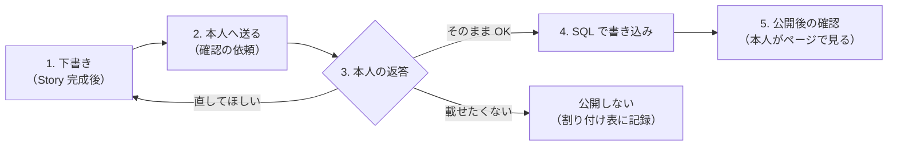

# 翻訳の本人確認フロー（公開前確認）

> 翻訳段落（F3「この人の何が凄いか」）は運営が書くが、**公開前に本人に確認する**（[`prd.md`](../../../discussions/prd/know-to-support-verification/prd.md) §7-6「本人の言葉と食い違うと信頼を失う」）。本人の言葉（公式）と運営の言葉（翻訳）は画面上で混ぜない（§2-4）。
> **時限ドキュメント**（[`plan.md`](../plan.md) の T11）。対象は [`translation-assignment.md`](./translation-assignment.md) のあり群のみ。

---

## 1. 前提

- 翻訳に API は作らない。運営が SQL で書き込む（[`interface-map.md`](../interface-map.md) §5 協議点 1、T05 #276）
- 翻訳は「一段落」（§5-2 順 3）。技の説明ではなく、大衆が分かる言葉で「何が凄いか」を書く（§1-1 用語「翻訳」）
- 書く材料は、本人の Story（3 章）・聞き取り①②の記録・聴きどころの動画。**本人が書いていないことを事実として足さない**

## 2. フロー



| 段階 | やること                                                                                                               | 期限（案）                    | 記録                                 |
| ---- | ---------------------------------------------------------------------------------------------------------------------- | ----------------------------- | ------------------------------------ |
| 1    | 本人の Story が書き上がり、聞き取り②が終わってから下書きする。Story より先に書かない（本人の言葉を先に固定する）       | Story 完成から 3 日以内       | 下書きの版と日付                     |
| 2    | §3 の文面で本人に送る。聞くのは「事実の誤り」と「自分の言葉との食い違い」の 2 点。見た目・文体の好みは聞かない（§7-6） | —                             | 送付日                               |
| 3    | 返答を待つ。修正が入ったら段階 1 に戻る。往復は 2 回までを目安にし、それでも揃わなければ載せない（**案**）             | 返答待ちは 5 日まで（**案**） | 返答日・返答の種類（OK／修正／不可） |
| 4    | 本人が OK した版を、そのまま SQL で書き込む（OK 後に文言を変えない）                                                   | OK から 1 日以内              | 書き込み日・書き込んだ版             |
| 5    | 公開ページの URL を本人に送り、画面上で「本人の言葉」と「運営の言葉」が分かれて見えているかを本人に確認してもらう      | 書き込み当日                  | 本人の確認日                         |

段階 3 の「返答待ち 5 日」を過ぎたら、翻訳なしで告知に進む（告知の時期を翻訳で遅らせない。H1 の検証が先）。その人はあり群のまま「翻訳未公開」として記録し、H4 の母数から外す。

## 3. 本人へ送る文面

```
〇〇さんの Story を読んで、シーンの外の人向けに「〇〇さんの何が凄いか」を一段落書きました。
ページでは〇〇さんの言葉とは分けて、「運営から」として載せます。

---
（翻訳の下書き）
---

2 点だけ確認させてください。
1. 事実として違うところはありますか
2. 〇〇さん自身の言葉や考えと食い違うところはありますか

問題なければ、このまま載せます。直したいところがあれば、そのまま教えてください。
```

## 4. 記録表（あり群 1 人 1 行）

| 仮 ID | 下書き日 | 送付日 | 返答日 | 返答（OK／修正／不可） | 往復回数 | 書き込み日 | 本人の公開後確認 |
| ----- | -------- | ------ | ------ | ---------------------- | -------- | ---------- | ---------------- |
| P\_\_ |          |        |        |                        |          |            |                  |
| P\_\_ |          |        |        |                        |          |            |                  |
| P\_\_ |          |        |        |                        |          |            |                  |
| P\_\_ |          |        |        |                        |          |            |                  |

## 5. 書くときの禁止事項

| してはいけない                                    | 理由                                                                               |
| ------------------------------------------------- | ---------------------------------------------------------------------------------- |
| 本人の Story の文章を翻訳に写す・言い換えて重ねる | 本人の言葉と運営の言葉が混ざる（§2-4）                                             |
| 大会結果・技名をそのまま並べる                    | 内側の評価軸のままで、外の人には伝わらない（§2-1）                                 |
| 本人が OK した後に文言を直す                      | 本人確認の意味が無くなる。直すなら段階 2 からやり直す                              |
| なし群の人の翻訳を書く                            | H4 の比較が壊れる（[`translation-assignment.md`](./translation-assignment.md) §1） |
