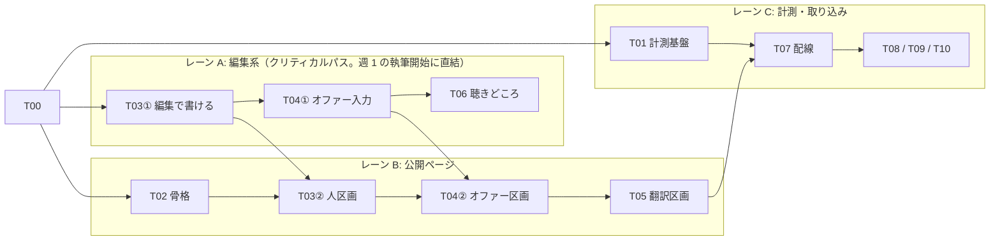

# 実行計画 — 「知る → 応援する」検証ベータ

> [`prd.md`](../../discussions/prd/know-to-support-verification/prd.md) のベータ（5〜8 人 × 6〜8 週）を実装・運用するための実行計画。
> **時限ドキュメント**（`plans/` の規約どおり、ベータ終了後は参照しない）。
> 分解の方法論は `.claude/skills/task-breakdown/SKILL.md`、実装レールは `.claude/skills/beta-ticket/SKILL.md`。
> 作業の状態・各チケットの詳細（タスク設計書）の正本は **GitHub Issues**。本書は全体像だけを持つ。

- 統合 Issue: [#270](https://github.com/hirayamahiroto/beatSinkCentral/issues/270)（進捗はここを見る）
- マイルストーン: `know-to-support-beta`
- インターフェース契約: [`interface-map.md`](./interface-map.md)（T00 で凍結）
- ベータ運用キット（手作業。候補者リスト・声かけ・割り付け・聞き取り・翻訳確認・週次進行・記録メール）: [`ops/README.md`](./ops/README.md)（T11）

---

## 1. 管理の分担（どこに何があるか）

| 情報                                                           | 正本                                                                                              |
| -------------------------------------------------------------- | ------------------------------------------------------------------------------------------------- |
| 検証の定義（仮説・指標・判断基準）                             | [`prd.md`](../../discussions/prd/know-to-support-verification/prd.md)（discussions・未合意）      |
| コンセプト・二周目以降の予約論点                               | [`concept-and-loops.md`](../../discussions/prd/know-to-support-verification/concept-and-loops.md) |
| 画面 → BFF → API の契約                                        | [`interface-map.md`](./interface-map.md)                                                          |
| 実行計画の全体像                                               | 本書                                                                                              |
| 各チケットの設計書（紐づく要件・最終挙動・受け入れ条件）と状態 | **各 sub-issue**（#271〜#284）                                                                    |
| 分解・粒度の方法論                                             | `.claude/skills/task-breakdown/SKILL.md`                                                          |
| 実装の判断根拠                                                 | `docs/product/` と `docs/architecture/` のみ（CLAUDE.md の規約）                                  |

---

## 2. チケット一覧

> 2026-09-02 に `task-breakdown` skill で再分割（旧 #255〜#269 は後継付きで close 済み）。
> PR は「1 画面（区画）＋関連 API」の縦切りが既定。分割があるチケットは Issue 本文の「PR 分割」参照。

| Issue                                                                | ID  | 約束                                             | 種別   | 依存           | PR  |
| -------------------------------------------------------------------- | --- | ------------------------------------------------ | ------ | -------------- | --- |
| [#271](https://github.com/hirayamahiroto/beatSinkCentral/issues/271) | T00 | 規範との差分合意・インターフェース凍結           | 決める | —              | —   |
| [#272](https://github.com/hirayamahiroto/beatSinkCentral/issues/272) | T01 | 計測基盤 — イベントを送ると記録される            | 作る   | T00            | 1   |
| [#273](https://github.com/hirayamahiroto/beatSinkCentral/issues/273) | T02 | 詳細ページ骨格 — §5-2 の順で未ログイン閲覧できる | 作る   | T00            | 1   |
| [#274](https://github.com/hirayamahiroto/beatSinkCentral/issues/274) | T03 | Story 章構造化 — 書けて読める ★クリティカルパス  | 作る   | T00（②は T02） | 2   |
| [#275](https://github.com/hirayamahiroto/beatSinkCentral/issues/275) | T04 | オファー — 入力できて公開ページに出る            | 作る   | T00（②は T02） | 2   |
| [#276](https://github.com/hirayamahiroto/beatSinkCentral/issues/276) | T05 | 翻訳段落 — 本人の言葉と分離されて出る            | 作る   | T02            | 1   |
| [#277](https://github.com/hirayamahiroto/beatSinkCentral/issues/277) | T06 | 聴きどころ — 入力できて聴ける                    | 作る   | T02            | 1   |
| [#278](https://github.com/hirayamahiroto/beatSinkCentral/issues/278) | T07 | 計測配線 — 動線でイベントが落ちる                | 作る   | T01, T02〜T06  | 1   |
| [#279](https://github.com/hirayamahiroto/beatSinkCentral/issues/279) | T08 | 一問アンケート — 外の人かどうかが記録される      | 作る   | T01, T02       | 1   |
| [#280](https://github.com/hirayamahiroto/beatSinkCentral/issues/280) | T09 | 受信登録 — メールで戻り道を持てる                | 作る   | T01, T02       | 1   |
| [#281](https://github.com/hirayamahiroto/beatSinkCentral/issues/281) | T10 | 招待リンク — 共演者が招待経由で登録できる        | 作る   | T01, T04       | 2   |
| [#282](https://github.com/hirayamahiroto/beatSinkCentral/issues/282) | T11 | ベータ運用キット                                 | 手作業 | —              | —   |
| [#283](https://github.com/hirayamahiroto/beatSinkCentral/issues/283) | T12 | 告知素材                                         | 手作業 | T02            | —   |
| [#284](https://github.com/hirayamahiroto/beatSinkCentral/issues/284) | T13 | 週次の数字の返し                                 | 手作業 | T07            | —   |

## 3. レーンと依存（ベータ週割りからの逆算）

**骨格先行**: T02（骨格）を先頭に置き、各機能の公開側 PR が完成した区画を骨格に載せていく。マージのたびにページが育ち、結合が毎回検証される。

- **並行規則**: レーン内は常に open PR 1 本。レーン間は契約（interface-map）を共有しないので並行可
- **migration 着地順（直列）**: T01 → T03① → T04① → T09 → T10①
- **週割り対応**: 週 1 までに T03①（執筆開始）／週 2〜3 までに レーン B・C 完走（告知に URL を貼る）／週 3〜6 は T12〜T13 の運用
- レーン D（手作業）: T11 はいつでも、T12 は T02 後、T13 は T07 後

## 4. 着手順序（現時点）

1. **T00（#271）** — ユーザーの判断が必要な唯一のチケット（PRD 4 決定＋ interface-map §5 の協議点 4 つ）
2. T03①（#274・クリティカルパス）と T01（#272）・T02（#273）を並行着手。T11（#282）はいつでも
3. 以後はレーン順
